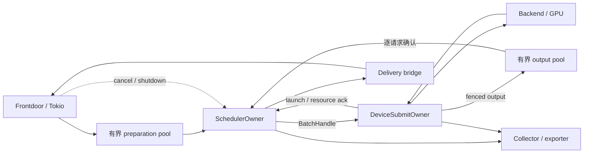

# CPU 控制与资源生命周期

本文说明 GPU 引擎的 CPU 控制、准备、提交与交付契约。具体执行器能力见 [Backend](backends.md)，计量范围见 [CPU 性能测量](../guides/cpu-performance.md)。

## Owner 与线程预算



| 角色 | 独占内容与工作 |
|---|---|
| Frontdoor | 连接、外部 ID、IngressSlot、协议与网络 await |
| Preparation | worker-local tokenizer/template/scratch、冷 workload 规划 |
| SchedulerOwner | request/tenant/ready 表、host token、逻辑状态、flight、调度与完成提交 |
| DeviceSubmitOwner | context/queue、buffer、metadata、ticket/fence、GPU 编码与完成检测 |
| Output pool | sampling、projection 与共享结果 reader |
| Delivery | token 游标、detokenization、SSE/JSON、断连与消费确认 |
| Collector | 有界事件/trace、只读 snapshot、诊断格式化与导出 |

每个 GPU shard 一个 scheduler 与 device owner，固定 worker 在启动时创建。CPU 重任务不得进入 Tokio 网络任务或 scheduler。准备、输出、交付、观测与库内部线程池统一核算可用核预算，避免嵌套并行。多 GPU 按 device 分片，跨 shard 状态转移先排空在途引用。

物理 lease 决策 ledger 的目标 owner 是 scheduler，设备只维护执行镜像；当前实际边界见 [KV Manager](../architecture/kv-manager.md)。

## 队列与背压

多生产者入口使用有界 MPSC，只有确实是单生产者/消费者时才用 SPSC。batch payload 保存在 arena，ring 只传 owner/generation handle，不能把 cloned producer 当作 SPSC。

| 边界 | 预算与满队列动作 |
|---|---|
| 网络 → preparation | pending bytes、jobs、queue age；限时等待或容量拒绝 |
| prepared → scheduler | staging/token credits；未接入对象留在受限 worker，不再取新任务 |
| scheduler → device | batch/metadata/output/ack slots；停止发布，继续完成与 control |
| device → scheduler/output | 发布前预留可靠 ack/completion 与 reader credits |
| scheduler → delivery | token/output bytes 与 terminal credit；只阻塞或取消对应请求 |
| owners → collector | 有界 POD events；允许丢 trace 并计数，不丢完成与资源确认 |

准入先取得准备额度，接入前取得 request、token/state 与 terminal credits，失败按阶段归还。bulk 与 cancel/shutdown 分 lane，取消使用带 generation 的持久 mailbox，shutdown 使用 sticky 状态。generation 比较与写入必须原子，防止 slot 复用造成 ABA。

每轮 completion/control、prepared ingress、maintenance 与 planning 都有有限份额，不能 drain-until-empty。按条数、持有字节和最老等待时间限制队列；terminal 额度在 accepted 时保留，慢客户端不能无限保留输出或阻塞整个 shard。

## 增量调度

常驻 `RequestHotSoA`、tenant/lifecycle 队列、ready/deadline/aging 索引与 `PlanningScratch`。冷 prompt、JSON、traceparent 与错误文本和热字段分离；tenant/program 字符串在冷路径转换为整数身份。

ReadyDelta 只更新变化项，按兼容域、tenant WFQ、urgent/aging 与阶段选择候选。候选窗口 K、batch B、成本探测与维护预算约束单次工作量；窗口外与资源不足分别解释，轮转与 aging 防止反复只访问相同 K 项。

批次限制 tokens、GPU time、workspace、logical/device page、private state、transfer 与 encoder。资源阻塞进入 waiter，由 epoch/credit 变化唤醒。只有声明单调或可加的成本模型才允许摘要或二分；其他 provider 使用有界完整预测。校准在 owner 边界提交，不在一次 decision 内改变排序键。

工作量取决于变动 H、候选 K、batch B 与增页 ΔP：索引更新约为 `O(H log R)`，packing 可包含 `K × B` 次检查。完整诊断/快照仍可能遍历全部状态，不能据候选窗口宣称整个引擎 O(1)。

决策记录 ready/resource/cost epoch、窗口、选中与检查过的候选、阻塞原因；冷查询在有界基线与 delta 上展开，缺少历史时报告 gap。热验证检查身份、frontier、重复 state、容量与转移；全表 lease 平衡、heap 与冷热一致性由独立 verifier 检查。

## 内存与 zero-copy

启动时冻结容量，checked sizing 后预留并触碰 request/batch/flight arena、token storage、索引、页/lease 表、scratch、metadata/output 与确认池。更改 pool、compute depth 或 placement 必须排空重建；动态策略变更带 config epoch。

```text
host_bytes = request/tenant/index/token storage + preparation/staging
           + batch/flight/metadata/output + delivery retention
           + observation/snapshots + queue/ack storage
```

managed budget 包含固定存储与请求峰值，history 独立限额；它不是 RSS 或 driver allocator 上限。默认使用 mimalloc；热路径计数同时检查 alloc/realloc/dealloc。共享权重与 program，避免逐 token 的 `Arc`/`Mutex`，也不让冷对象最后一次 drop 发生在 owner 线程。

prompt 与结果共享只读 payload，生成的 token 追加到预留存储。prefill 提交 token range，decode 只提交新 token/frontier/page delta，CPU 拷贝量不随累计上下文增长。rerank 当前在 preparation 中拼接连续 query/document，计入预算，不能算作 zero-copy。

普通 Generate 只保留所需 hidden/logits；Full readout、probe、profile 与 prefix snapshot 显式报价。CPU sampling 使用常驻 scratch 与有界输出池。SoA、cache-line 分离、批处理与向量化依据实际 profile；手写 SIMD 必须检测 ISA，并保持 tie/NaN/采样语义。

## 发布、完成与回收

`Published → LaunchAck → DeviceComplete → CpuConsumed → Committed` 分别记录传输、实际设备执行、CPU reader 与状态提交。发布时只形成 provisional/reserved frontier，失败原子回滚；只有身份与 fence 匹配才推进 committed frontier。

| 资源 | 复用条件 |
|---|---|
| ring cell | consumer 已取 handle，仅释放 ring 空间 |
| host input/metadata | DMA 完成；共享或映射读取需等最后一个 GPU reader |
| device metadata/input/output | 最后一个 device reader/writer 与 D2H 完成 |
| KV/recurrent/workspace | device fence、pin 与 active/cache refcount 均满足 |
| host output | device 写入完成且所有 CPU reader 已消费 |
| flight/request slot | completion commit、reader/回调退出、credits 与资源确认收敛 |

CPU 侧的 Release/Acquire 不能替代 DMA 或设备同步。cancel、timeout、ticket drop 与客户端终止都不能提前释放。generation 耗尽即退休 slot；旧 handle、外池 handle 与重复确认必须拒绝。

GPU 执行请求 N 时可以准备独立请求 N+1，provisional plan 在 ready/resource/cost/config epoch 变化后重新校验；同一请求的下一个 decode token 等待上一步结果。metadata 数、published depth 与 compute depth 分别配置，提高并行度必须证明 scratch/output/state hazard 已隔离。

Quiesce 停止准入与 dispatch，排空 flight、resource command 与 CPU reader 后捕获 checkpoint，不保存 native ticket；恢复时校验 schema、program/weights/provider 身份、游标、成本状态与物理数据。

## 设备传输与 CPU 放置

NVIDIA 使用有总字节限制的持久 pinned host/device pool，按 batch 合并 span 与页表 delta，用 event 连接 H2D、compute、D2H；graph 与 direct recipe 共享生命周期，离散 GPU 默认不使用 mapped host KV，参考 [CUDA 传输最佳实践](https://docs.nvidia.com/cuda/cuda-c-best-practices-guide/index.html#asynchronous-and-overlapping-transfers-with-computation)。

Metal 的 shared/private storage 遵守 UMA 读写与完成契约，共享地址仍需 fence，参考 [Apple storage modes](https://developer.apple.com/documentation/metal/choosing-a-resource-storage-mode-for-apple-gpus)。

owner 有进展时处理有限工作，无工作时根据通知或 deadline park。等待前 arm、重读 wake epoch 与 lane，避免 lost wake。callback 只更新预留的原子状态并唤醒；adaptive poll 与短 spin 有预算，其延迟计入 completion detection。

Linux 在继承的 cpuset 内选择不同物理核，先设置 NUMA 策略再初始化/first touch，并报告实际放置；macOS 只承诺 QoS/affinity hint。部署规则见 [Linux 指南](../guides/linux.md)。
